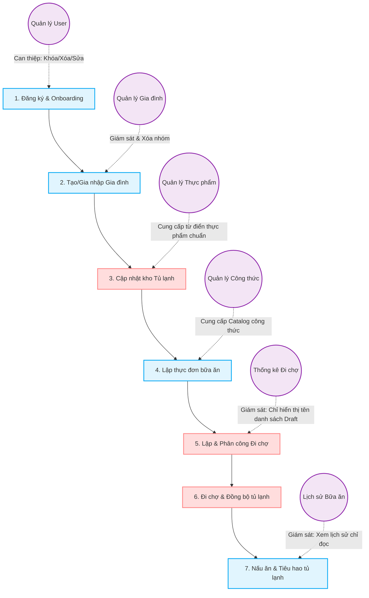

# Báo Cáo Phân Tích Tổng Hợp & So Sánh Hệ Thống (User ↔ Admin)

Tài liệu này cung cấp báo cáo đánh giá toàn diện dưới các góc nhìn của Product Owner, Business Analyst, Frontend Architect và QA Lead cho hệ thống **NAT-EAT (Meal Group Genius)** gồm hai phân hệ: **Frontend User** và **Frontend Admin**.

---

## Mục Lục
- [PHẦN 1 — TỔNG QUAN HỆ THỐNG](#phần-1--tổng-quan-hệ-thống)
- [PHẦN 2 — USER FEATURE INVENTORY](#phần-2--user-feature-inventory)
- [PHẦN 3 — ADMIN FEATURE INVENTORY](#phần-3--admin-feature-inventory)
- [PHẦN 4 — USER ↔ ADMIN MAPPING](#phần-4--user--admin-mapping)
- [PHẦN 5 — DỮ LIỆU USER KHÔNG THỂ QUẢN LÝ](#phần-5--dữ-liệu-user-không-thể-quản-lý)
- [PHẦN 6 — CHỨC NĂNG ADMIN DƯ THỪA](#phần-6--chức-năng-admin-dư-thừa)
- [PHẦN 7 — PHÂN TÍCH CRUD COVERAGE](#phần-7--phân-tích-crud-coverage)
- [PHẦN 8 — PHÂN TÍCH PERMISSION](#phần-8--phân-tích-permission)
- [PHẦN 9 — PHÂN TÍCH UX FLOW](#phần-9--phân-tích-ux-flow)
- [PHẦN 10 — PHÂN TÍCH DATABASE COVERAGE](#phần-10--phân-tích-database-coverage)
- [PHẦN 11 — BUG NGHIỆP VỤ](#phần-11--bug-nghiệp-vụ)
- [PHẦN 12 — UX AUDIT](#phần-12--ux-audit)
- [PHẦN 13 — GAP ANALYSIS](#phần-13--gap-analysis)
- [PHẦN 14 — FINAL VERDICT](#phần-14--final-verdict)

---

## PHẦN 1 — TỔNG QUAN HỆ THỐNG

Dưới đây là bảng đối chiếu tổng quan các module nghiệp vụ lớn giữa phân hệ User (Ứng dụng người dùng cuối và gia đình) và phân hệ Admin (Bảng quản trị hệ thống):

| Module | Phân hệ User (Mobile/Web Client) | Phân hệ Admin (Web Portal) |
| :--- | :--- | :--- |
| **Authentication & Auth** | Đăng nhập, đăng ký, quên mật khẩu, phiên làm việc (Mock Token). | Đăng nhập quản trị, bảo vệ route theo role `ADMIN`. |
| **User Profile Management** | Cập nhật thông tin cá nhân (Email, Tên), đổi mật khẩu. | Đổi mật khẩu Admin, cập nhật hồ sơ cá nhân Admin. |
| **Onboarding & Splash** | Màn hình khởi động chào mừng (Splash) và hướng dẫn onboarding ban đầu. | Không có (Bỏ qua trực tiếp tới trang Login/Dashboard). |
| **User Account Control** | Không có quyền (chỉ tự quản lý tài khoản của mình). | Quản lý người dùng: Xem, thêm mới, cập nhật, khóa/mở khóa tài khoản, đặt lại mật khẩu, xóa vĩnh viễn (đơn/hàng loạt). |
| **Family Group Management** | Xem thành viên, đổi tên nhóm, tạo nhóm mới, thêm thành viên bằng email/ID, gia nhập nhóm bằng ID. | Quản lý nhóm gia đình: Xem danh sách nhóm, xem thành viên của nhóm, xóa nhóm gia đình (cascade delete). |
| **Fridge Inventory Management** | Xem tủ lạnh gia đình, thêm thực phẩm, chỉnh sửa số lượng/ngày hết hạn/vị trí bảo quản, xóa (đơn/hàng loạt), hoàn tác xóa. | Không có màn hình quản lý trực tiếp. Chỉ xóa cascade khi xóa hộ gia đình. |
| **Shopping List Management** | Tạo danh sách mua sắm (hàng ngày/tuần), thêm sản phẩm (mới/sẵn có), phân công nhiệm vụ, cập nhật tiến độ mua, đồng bộ tủ lạnh, hoàn tất danh sách. | Xem tiêu đề & trạng thái các danh sách đang soạn (Draft) qua modal Dashboard. Không có màn hình CRUD. |
| **Meal Planner & History** | Xem thực đơn hôm nay, lên kế hoạch ăn uống theo ngày/loại bữa ăn, gợi ý món ăn tự động theo thực phẩm hiện có. | Giám sát lịch sử bữa ăn của toàn hệ thống (Xem, in báo cáo, xuất CSV). Không có màn hình CRUD. |
| **Recipe Management** | Xem gợi ý món ăn, tìm kiếm, lọc độ khó/calo/thời gian, xem chi tiết công thức (nguyên liệu, cách làm), xác nhận đã nấu (tiêu hao tủ lạnh). | Quản lý danh mục công thức: Xem, thêm mới, cập nhật thông tin + nguyên liệu, xóa vĩnh viễn (đơn/hàng loạt). |
| **Food Dictionary** | Sử dụng làm từ điển chọn nhanh trong Tủ lạnh / Mua sắm. Tự động thêm thực phẩm tùy chọn khi đi chợ. | Quản lý từ điển thực phẩm chuẩn: Xem, thêm mới, sửa tên/đơn vị/nhãn/emoji, xóa (đơn/hàng loạt). |
| **System Statistics** | Xem thống kê tủ lạnh, tỷ lệ lãng phí, xu hướng tiêu dùng, biểu đồ phân phối danh mục, danh sách thực phẩm hết hạn. | Tổng quan Dashboard: Biểu đồ số lượng bữa ăn, biểu đồ danh mục, biểu đồ tương tác, nhật ký 10 hoạt động gần nhất. |

---

## PHẦN 2 — USER FEATURE INVENTORY

Chi tiết các tính năng, đường dẫn, component chính, API sử dụng và cấp độ CRUD ở phía **Frontend User**:

### 1. Module: Authentication & Profile
* **Đăng ký tài khoản**:
  * **Route**: `/register`
  * **Component**: [RegisterPage.tsx](file:///c:/Users/KHANH/Documents/GitHub/meal-group-genius/frontend_user/src/modules/auth/pages/RegisterPage.tsx)
  * **API sử dụng**: `authApi.register`
  * **CRUD level**: Create (Sinh mới người dùng + nhóm gia đình mặc định)
* **Đăng nhập**:
  * **Route**: `/login`
  * **Component**: [LoginPage.tsx](file:///c:/Users/KHANH/Documents/GitHub/meal-group-genius/frontend_user/src/modules/auth/pages/LoginPage.tsx)
  * **API sử dụng**: `authApi.login`
  * **CRUD level**: Create session (Kiểm tra mật khẩu, vai trò và trạng thái khóa)
* **Xem & Cập nhật Hồ sơ**:
  * **Route**: `/profile`
  * **Component**: [ProfilePage.tsx](file:///c:/Users/KHANH/Documents/GitHub/meal-group-genius/frontend_user/src/modules/auth/pages/ProfilePage.tsx)
  * **API sử dụng**: `authApi.updateProfile`
  * **CRUD level**: Read, Update
* **Thay đổi mật khẩu**:
  * **Route**: `/change-password`
  * **Component**: [ChangePasswordPage.tsx](file:///c:/Users/KHANH/Documents/GitHub/meal-group-genius/frontend_user/src/modules/auth/pages/ChangePasswordPage.tsx)
  * **API sử dụng**: `authApi.changePassword`
  * **CRUD level**: Update
* **Khôi phục mật khẩu nhanh (Quên mật khẩu)**:
  * **Route**: Trực tiếp tại `/login` qua modal.
  * **Component**: [LoginPage.tsx](file:///c:/Users/KHANH/Documents/GitHub/meal-group-genius/frontend_user/src/modules/auth/pages/LoginPage.tsx)
  * **API sử dụng**: `authApi.resetPasswordByEmail`
  * **CRUD level**: Update

### 2. Module: Family Group Management
* **Xem thông tin chi tiết gia đình**:
  * **Route**: `/family`
  * **Component**: [FamilyPage.tsx](file:///c:/Users/KHANH/Documents/GitHub/meal-group-genius/frontend_user/src/modules/family/pages/FamilyPage.tsx)
  * **API sử dụng**: `familyApi.detail`
  * **CRUD level**: Read
* **Đổi tên nhóm gia đình**:
  * **Route**: `/family`
  * **Component**: [FamilyPage.tsx](file:///c:/Users/KHANH/Documents/GitHub/meal-group-genius/frontend_user/src/modules/family/pages/FamilyPage.tsx)
  * **API sử dụng**: `familyApi.rename`
  * **CRUD level**: Update
* **Thêm thành viên bằng Email**:
  * **Route**: `/family`
  * **Component**: [FamilyPage.tsx](file:///c:/Users/KHANH/Documents/GitHub/meal-group-genius/frontend_user/src/modules/family/pages/FamilyPage.tsx)
  * **API sử dụng**: `familyApi.addMember`
  * **CRUD level**: Create (Tạo mới liên kết `family_members`)
* **Gia nhập nhóm bằng ID**:
  * **Route**: `/family`
  * **Component**: [FamilyPage.tsx](file:///c:/Users/KHANH/Documents/GitHub/meal-group-genius/frontend_user/src/modules/family/pages/FamilyPage.tsx)
  * **API sử dụng**: `familyApi.joinFamilyById`
  * **CRUD level**: Create
* **Tạo nhóm gia đình mới**:
  * **Route**: `/family`
  * **Component**: [FamilyPage.tsx](file:///c:/Users/KHANH/Documents/GitHub/meal-group-genius/frontend_user/src/modules/family/pages/FamilyPage.tsx)
  * **API sử dụng**: `familyApi.createFamily`
  * **CRUD level**: Create

### 3. Module: Fridge Inventory Management
* **Xem danh sách thực phẩm trong tủ lạnh**:
  * **Route**: `/fridge`
  * **Component**: [FridgePage.tsx](file:///c:/Users/KHANH/Documents/GitHub/meal-group-genius/frontend_user/src/modules/fridge/pages/FridgePage.tsx)
  * **API sử dụng**: `fridgeApi.list`
  * **CRUD level**: Read
* **Thêm thực phẩm vào tủ lạnh**:
  * **Route**: `/fridge/add`
  * **Component**: [FridgeFormPage.tsx](file:///c:/Users/KHANH/Documents/GitHub/meal-group-genius/frontend_user/src/modules/fridge/pages/FridgeFormPage.tsx)
  * **API sử dụng**: `fridgeApi.create`
  * **CRUD level**: Create
* **Cập nhật thực phẩm trong tủ lạnh**:
  * **Route**: `/fridge/:id` hoặc `/fridge/edit/:id`
  * **Component**: [FridgeFormPage.tsx](file:///c:/Users/KHANH/Documents/GitHub/meal-group-genius/frontend_user/src/modules/fridge/pages/FridgeFormPage.tsx)
  * **API sử dụng**: `fridgeApi.update`
  * **CRUD level**: Update
* **Xóa thực phẩm khỏi tủ lạnh**:
  * **Route**: `/fridge`
  * **Component**: [FridgePage.tsx](file:///c:/Users/KHANH/Documents/GitHub/meal-group-genius/frontend_user/src/modules/fridge/pages/FridgePage.tsx)
  * **API sử dụng**: `fridgeApi.remove`
  * **CRUD level**: Delete
* **Xóa hàng loạt thực phẩm**:
  * **Route**: `/fridge`
  * **Component**: [FridgePage.tsx](file:///c:/Users/KHANH/Documents/GitHub/meal-group-genius/frontend_user/src/modules/fridge/pages/FridgePage.tsx)
  * **API sử dụng**: `fridgeApi.removeMany`
  * **CRUD level**: Delete
* **Hoàn tác xóa**:
  * **Route**: `/fridge` (Qua toast thông báo)
  * **Component**: [FridgePage.tsx](file:///c:/Users/KHANH/Documents/GitHub/meal-group-genius/frontend_user/src/modules/fridge/pages/FridgePage.tsx)
  * **API sử dụng**: `fridgeApi.create`
  * **CRUD level**: Create

### 4. Module: Shopping List Management
* **Xem danh sách mua sắm**:
  * **Route**: `/shopping`
  * **Component**: [ShoppingPage.tsx](file:///c:/Users/KHANH/Documents/GitHub/meal-group-genius/frontend_user/src/modules/shopping/pages/ShoppingPage.tsx)
  * **API sử dụng**: `shoppingApi.list`
  * **CRUD level**: Read
* **Tạo danh sách mua sắm**:
  * **Route**: `/shopping/create`
  * **Component**: [ShoppingCreatePage.tsx](file:///c:/Users/KHANH/Documents/GitHub/meal-group-genius/frontend_user/src/modules/shopping/pages/ShoppingCreatePage.tsx)
  * **API sử dụng**: `shoppingApi.create`
  * **CRUD level**: Create (Hỗ trợ tự gõ tên nguyên liệu mới tự động sinh thực phẩm trong Mock DB)
* **Xem chi tiết danh sách**:
  * **Route**: `/shopping/:id`
  * **Component**: [ShoppingDetailPage.tsx](file:///c:/Users/KHANH/Documents/GitHub/meal-group-genius/frontend_user/src/modules/shopping/pages/ShoppingDetailPage.tsx)
  * **API sử dụng**: `shoppingApi.detail`
  * **CRUD level**: Read
* **Thêm nhanh mặt hàng vào danh sách**:
  * **Route**: `/shopping/:id`
  * **Component**: [ShoppingDetailPage.tsx](file:///c:/Users/KHANH/Documents/GitHub/meal-group-genius/frontend_user/src/modules/shopping/pages/ShoppingDetailPage.tsx)
  * **API sử dụng**: `shoppingApi.upsertItem`
  * **CRUD level**: Create / Update
* **Xóa mặt hàng khỏi danh sách**:
  * **Route**: `/shopping/:id`
  * **Component**: [ShoppingDetailPage.tsx](file:///c:/Users/KHANH/Documents/GitHub/meal-group-genius/frontend_user/src/modules/shopping/pages/ShoppingDetailPage.tsx)
  * **API sử dụng**: `shoppingApi.deleteItems`
  * **CRUD level**: Delete
* **Cập nhật số lượng đã mua & đồng bộ tủ lạnh**:
  * **Route**: `/shopping/:id`
  * **Component**: [ShoppingDetailPage.tsx](file:///c:/Users/KHANH/Documents/GitHub/meal-group-genius/frontend_user/src/modules/shopping/pages/ShoppingDetailPage.tsx)
  * **API sử dụng**: `shoppingApi.recordPurchase`
  * **CRUD level**: Update (Tự động tính chênh lệch delta và gọi `addInventory` vào tủ lạnh)
* **Hoàn tất danh sách mua sắm**:
  * **Route**: `/shopping/:id`
  * **Component**: [ShoppingDetailPage.tsx](file:///c:/Users/KHANH/Documents/GitHub/meal-group-genius/frontend_user/src/modules/shopping/pages/ShoppingDetailPage.tsx)
  * **API sử dụng**: `shoppingApi.complete`
  * **CRUD level**: Update

### 5. Module: Meal Planner & Recipes
* **Xem danh sách công thức & gợi ý**:
  * **Route**: `/meal-planner`
  * **Component**: [MealPlanPage.tsx](file:///c:/Users/KHANH/Documents/GitHub/meal-group-genius/frontend_user/src/modules/meal-plan/pages/MealPlanPage.tsx)
  * **API sử dụng**: `recipeApi.list`, `recipeApi.suggestions`, `mealApi.grouped`
  * **CRUD level**: Read
* **Xem chi tiết công thức nấu ăn**:
  * **Route**: `/recipes/:id`
  * **Component**: [RecipeDetailPage.tsx](file:///c:/Users/KHANH/Documents/GitHub/meal-group-genius/frontend_user/src/modules/recipe/pages/RecipeDetailPage.tsx)
  * **API sử dụng**: `recipeApi.detail`
  * **CRUD level**: Read
* **Đánh dấu đã nấu (Tiêu hao thực phẩm)**:
  * **Route**: `/recipes/:id`
  * **Component**: [RecipeDetailPage.tsx](file:///c:/Users/KHANH/Documents/GitHub/meal-group-genius/frontend_user/src/modules/recipe/pages/RecipeDetailPage.tsx)
  * **API sử dụng**: `recipeApi.markCooked`
  * **CRUD level**: Update (Tiêu hao số lượng thực phẩm tương ứng trong tủ lạnh gia đình qua hàm `consumeInventory`)

### 6. Module: Statistics & Reports
* **Xem báo cáo lãng phí & tủ lạnh**:
  * **Route**: `/statistics`
  * **Component**: [StatisticsPage.tsx](file:///c:/Users/KHANH/Documents/GitHub/meal-group-genius/frontend_user/src/modules/statistics/pages/StatisticsPage.tsx)
  * **API sử dụng**: `statisticsApi.getOverview`, `statisticsApi.getDailyActivity`, `statisticsApi.getCategoryBar`, `statisticsApi.getFoodTrends`, `statisticsApi.getWasteReport`
  * **CRUD level**: Read

---

## PHẦN 3 — ADMIN FEATURE INVENTORY

Chi tiết các tính năng, đường dẫn, component chính, API sử dụng và cấp độ CRUD ở phía **Frontend Admin**:

### 1. Module: Authentication & Profile
* **Đăng nhập quản trị**:
  * **Route**: `/login`
  * **Component**: [LoginPage.tsx](file:///c:/Users/KHANH/Documents/GitHub/meal-group-genius/frontend_admin/src/pages/LoginPage.tsx)
  * **API sử dụng**: `authStore` (Ghi nhận trạng thái đăng nhập hệ thống Admin)
  * **CRUD level**: Create session
* **Hồ sơ & Đổi mật khẩu Admin**:
  * **Route**: `/settings`
  * **Component**: [SettingsPage.tsx](file:///c:/Users/KHANH/Documents/GitHub/meal-group-genius/frontend_admin/src/pages/settings/SettingsPage.tsx)
  * **API sử dụng**: `adminUserApi.update`, `adminUserApi.resetPassword`
  * **CRUD level**: Read, Update

### 2. Module: User Administration
* **Xem danh sách người dùng**:
  * **Route**: `/users`
  * **Component**: [UserListPage.tsx](file:///c:/Users/KHANH/Documents/GitHub/meal-group-genius/frontend_admin/src/pages/users/UserListPage.tsx)
  * **API sử dụng**: `adminUserApi.list`
  * **CRUD level**: Read
* **Thêm người dùng mới**:
  * **Route**: `/users/new`
  * **Component**: [UserFormPage.tsx](file:///c:/Users/KHANH/Documents/GitHub/meal-group-genius/frontend_admin/src/pages/users/UserFormPage.tsx)
  * **API sử dụng**: `adminUserApi.create`
  * **CRUD level**: Create
* **Cập nhật người dùng**:
  * **Route**: `/users/:id`
  * **Component**: [UserFormPage.tsx](file:///c:/Users/KHANH/Documents/GitHub/meal-group-genius/frontend_admin/src/pages/users/UserFormPage.tsx)
  * **API sử dụng**: `adminUserApi.update`
  * **CRUD level**: Update
* **Khóa / Mở khóa tài khoản**:
  * **Route**: `/users` (Qua nút thao tác nhanh hoặc modal)
  * **Component**: [UserListPage.tsx](file:///c:/Users/KHANH/Documents/GitHub/meal-group-genius/frontend_admin/src/pages/users/UserListPage.tsx)
  * **API sử dụng**: `adminUserApi.toggleLock`
  * **CRUD level**: Update
* **Đổi mật khẩu nhanh cho User**:
  * **Route**: `/users` (Qua modal đổi nhanh trên bảng)
  * **Component**: [UserListPage.tsx](file:///c:/Users/KHANH/Documents/GitHub/meal-group-genius/frontend_admin/src/pages/users/UserListPage.tsx)
  * **API sử dụng**: `adminUserApi.resetPassword`
  * **CRUD level**: Update
* **Xóa tài khoản đơn lẻ / Hàng loạt**:
  * **Route**: `/users`
  * **Component**: [UserListPage.tsx](file:///c:/Users/KHANH/Documents/GitHub/meal-group-genius/frontend_admin/src/pages/users/UserListPage.tsx)
  * **API sử dụng**: `adminUserApi.delete`, `adminUserApi.bulkDelete`
  * **CRUD level**: Delete (Xóa khỏi `users` và dọn `family_members`)

### 3. Module: Food Dictionary Management
* **Xem danh sách từ điển thực phẩm**:
  * **Route**: `/foods`
  * **Component**: [FoodListPage.tsx](file:///c:/Users/KHANH/Documents/GitHub/meal-group-genius/frontend_admin/src/pages/foods/FoodListPage.tsx)
  * **API sử dụng**: `adminFoodApi.list`
  * **CRUD level**: Read
* **Thêm thực phẩm chuẩn**:
  * **Route**: `/foods/new`
  * **Component**: [FoodFormPage.tsx](file:///c:/Users/KHANH/Documents/GitHub/meal-group-genius/frontend_admin/src/pages/foods/FoodFormPage.tsx)
  * **API sử dụng**: `adminFoodApi.create`
  * **CRUD level**: Create
* **Cập nhật thực phẩm chuẩn**:
  * **Route**: `/foods/:id`
  * **Component**: [FoodFormPage.tsx](file:///c:/Users/KHANH/Documents/GitHub/meal-group-genius/frontend_admin/src/pages/foods/FoodFormPage.tsx)
  * **API sử dụng**: `adminFoodApi.update`
  * **CRUD level**: Update
* **Xóa thực phẩm đơn lẻ / Hàng loạt**:
  * **Route**: `/foods`
  * **Component**: [FoodListPage.tsx](file:///c:/Users/KHANH/Documents/GitHub/meal-group-genius/frontend_admin/src/pages/foods/FoodListPage.tsx)
  * **API sử dụng**: `adminFoodApi.delete`, `adminFoodApi.bulkDelete`
  * **CRUD level**: Delete (Đồng thời dọn dẹp tủ lạnh, nguyên liệu công thức và danh sách đi chợ liên quan)

### 4. Module: Recipe Management
* **Xem danh sách công thức nấu ăn**:
  * **Route**: `/recipes`
  * **Component**: [RecipeListPage.tsx](file:///c:/Users/KHANH/Documents/GitHub/meal-group-genius/frontend_admin/src/pages/recipes/RecipeListPage.tsx)
  * **API sử dụng**: `adminRecipeApi.list`
  * **CRUD level**: Read
* **Thêm công thức & nguyên liệu thành phần**:
  * **Route**: `/recipes/new`
  * **Component**: [RecipeFormPage.tsx](file:///c:/Users/KHANH/Documents/GitHub/meal-group-genius/frontend_admin/src/pages/recipes/RecipeFormPage.tsx)
  * **API sử dụng**: `adminRecipeApi.create`
  * **CRUD level**: Create (Sinh thực thể công thức và thêm liên kết `recipe_ingredients`)
* **Cập nhật công thức & nguyên liệu**:
  * **Route**: `/recipes/:id`
  * **Component**: [RecipeFormPage.tsx](file:///c:/Users/KHANH/Documents/GitHub/meal-group-genius/frontend_admin/src/pages/recipes/RecipeFormPage.tsx)
  * **API sử dụng**: `adminRecipeApi.update`
  * **CRUD level**: Update
* **Xóa công thức đơn lẻ / Hàng loạt**:
  * **Route**: `/recipes`
  * **Component**: [RecipeListPage.tsx](file:///c:/Users/KHANH/Documents/GitHub/meal-group-genius/frontend_admin/src/pages/recipes/RecipeListPage.tsx)
  * **API sử dụng**: `adminRecipeApi.delete`, `adminRecipeApi.bulkDelete`
  * **CRUD level**: Delete

### 5. Module: Family Group Management
* **Xem danh sách nhóm gia đình**:
  * **Route**: `/families`
  * **Component**: [FamilyListPage.tsx](file:///c:/Users/KHANH/Documents/GitHub/meal-group-genius/frontend_admin/src/pages/families/FamilyListPage.tsx)
  * **API sử dụng**: `adminFamilyApi.list`
  * **CRUD level**: Read
* **Xem thành viên của nhóm**:
  * **Route**: `/families` (Qua modal popup)
  * **Component**: [FamilyListPage.tsx](file:///c:/Users/KHANH/Documents/GitHub/meal-group-genius/frontend_admin/src/pages/families/FamilyListPage.tsx)
  * **API sử dụng**: `adminFamilyApi.list`
  * **CRUD level**: Read
* **Xóa nhóm gia đình**:
  * **Route**: `/families` (Nút Trash và ConfirmDialog cảnh báo cascade delete)
  * **Component**: [FamilyListPage.tsx](file:///c:/Users/KHANH/Documents/GitHub/meal-group-genius/frontend_admin/src/pages/families/FamilyListPage.tsx)
  * **API sử dụng**: `adminFamilyApi.delete`
  * **CRUD level**: Delete (Cascade delete gia đình, thành viên, tủ lạnh, danh sách đi chợ, thực đơn, hoạt động)

### 6. Module: Meal History Auditing
* **Xem nhật ký bữa ăn hệ thống**:
  * **Route**: `/meals`
  * **Component**: [MealListPage.tsx](file:///c:/Users/KHANH/Documents/GitHub/meal-group-genius/frontend_admin/src/pages/meals/MealListPage.tsx)
  * **API sử dụng**: `adminMealApi.list`
  * **CRUD level**: Read
* **Xuất báo cáo CSV & In báo cáo**:
  * **Route**: `/meals`
  * **Component**: [MealListPage.tsx](file:///c:/Users/KHANH/Documents/GitHub/meal-group-genius/frontend_admin/src/pages/meals/MealListPage.tsx)
  * **API sử dụng**: Tạo file CSV động phía client và dùng `window.print()`
  * **CRUD level**: Read

### 7. Module: Dashboard & System Stats
* **Biểu đồ & Nhật ký hoạt động**:
  * **Route**: `/dashboard`
  * **Component**: [DashboardPage.tsx](file:///c:/Users/KHANH/Documents/GitHub/meal-group-genius/frontend_admin/src/pages/DashboardPage.tsx)
  * **API sử dụng**: `adminStatsApi.summary`, `adminStatsApi.mealsByDay`, `adminStatsApi.foodsByCategory`, `adminStatsApi.activityLogs`
  * **CRUD level**: Read

---

## PHẦN 4 — USER ↔ ADMIN MAPPING

Bảng đối chiếu ánh xạ các chức năng của người dùng (User App) với màn hình quản trị của quản trị viên (Admin App):

| Chức năng phía User (User Feature) | Màn hình quản lý tương ứng phía Admin (Admin Screen) | Trạng thái (Status) | Đánh giá & Ghi chú |
| :--- | :--- | :--- | :--- |
| **Đăng ký / Đăng nhập tài khoản** | Quản lý người dùng (`/users`) | **FULLY MANAGED** | Admin kiểm soát toàn bộ: thêm, sửa, xóa, khóa/mở khóa tài khoản, reset mật khẩu. |
| **Quản lý thông tin & Đổi mật khẩu** | Quản lý người dùng (`/users`) | **FULLY MANAGED** | Khớp hoàn toàn. |
| **Tạo nhóm & gia nhập nhóm gia đình** | Quản lý nhóm gia đình (`/families`) | **PARTIALLY MANAGED** | Admin chỉ có thể **Xem** danh sách/thành viên và **Xóa** nhóm. Không thể đổi tên, thêm thành viên hộ gia đình trực tiếp. |
| **Quản lý thực phẩm trong Tủ lạnh** | Không có màn hình riêng (Chỉ có trong mock DB) | **NOT MANAGED** | Admin **hoàn toàn không** có màn hình xem hay can thiệp vào kho tủ lạnh của từng gia đình (chỉ gián tiếp xóa qua gia đình). |
| **Soạn danh sách đi chợ** | Pop-up xem danh sách đi chợ Draft trên Dashboard | **PARTIALLY MANAGED** | Không có trang `/shopping` chuyên biệt. Admin chỉ có thể xem danh sách Draft ở modal trên Dashboard, không thể xem chi tiết mặt hàng, sửa đổi hay xóa danh sách đi chợ. |
| **Lên thực đơn ăn uống hàng ngày** | Lịch sử bữa ăn (`/meals`) | **PARTIALLY MANAGED** | Admin có màn hình xem danh sách và xuất file in ấn/CSV, nhưng hoàn toàn ở chế độ Read-only (không có CRUD). |
| **Xem danh mục công thức nấu ăn** | Quản lý công thức (`/recipes`) | **FULLY MANAGED** | Admin có toàn quyền CRUD công thức & nguyên liệu đi kèm. |
| **Sử dụng từ điển thực phẩm** | Quản lý thực phẩm (`/foods`) | **OVER MANAGED** | Admin có toàn quyền CRUD thực phẩm chuẩn. Tuy nhiên khi đi chợ, User vẫn có thể tự thêm thực phẩm tùy biến vào DB. |
| **Theo dõi nhật ký hoạt động gia đình** | Bảng Hoạt động mới nhất trên Dashboard | **PARTIALLY MANAGED** | Chỉ hiển thị 10 hoạt động gần nhất, không có bộ lọc hoặc trang lịch sử hoạt động đầy đủ để kiểm toán. |

---

## PHẦN 5 — DỮ LIỆU USER KHÔNG THỂ QUẢN LÝ

Dưới đây là danh sách chi tiết các dữ liệu do người dùng tạo ra hoặc tương tác trên ứng dụng di động nhưng Admin không có màn hình/chức năng quản trị tương ứng:

### 1. Dữ liệu: Family Fridge Inventory (Tủ lạnh gia đình)
* **Mô tả**: Người dùng liên tục tạo mới, cập nhật số lượng, ngày hết hạn và xóa thực phẩm trong tủ lạnh thông qua trang `/fridge` để quản lý bữa ăn hàng ngày.
* **Tình trạng Admin**: Admin không có bất kỳ màn hình nào để xem lượng thực phẩm tồn kho này của các hộ gia đình. Không thể hỗ trợ người dùng điều chỉnh số lượng khi có khiếu nại, không thể lọc thực phẩm hết hạn trên toàn hệ thống hay can thiệp khẩn cấp.
* **Mức độ nghiêm trọng**: **HIGH** (Thiếu khả năng audit dữ liệu cốt lõi của sản phẩm).

### 2. Dữ liệu: Shopping Lists & Purchase Records (Danh sách đi chợ & Lịch sử mua sắm)
* **Mô tả**: Người dùng tạo các danh sách đi chợ (Draft), thêm chi tiết các mặt hàng cần mua, đánh dấu số lượng thực tế đã mua và hoàn tất danh sách.
* **Tình trạng Admin**: Mặc dù Mock DB chứa toàn bộ bảng dữ liệu đi chợ (`shopping_lists` và `shopping_list_items`), Admin chỉ hiển thị một bảng danh sách "Đang soạn" thu nhỏ trên modal Dashboard. Admin không thể xem chi tiết các mặt hàng đi chợ, không thể xóa hoặc sửa đổi các danh sách bị lỗi hoặc rác, và không có màn hình lưu trữ danh sách đã mua (DONE).
* **Mức độ nghiêm trọng**: **HIGH** (Làm đứt gãy khả năng quản lý tài chính và hành vi tiêu dùng của User).

### 3. Dữ liệu: Meal Plans (Kế hoạch bữa ăn)
* **Mô tả**: Dữ liệu lịch trình ăn uống của gia đình theo ngày và theo bữa (Sáng, Trưa, Tối, Bữa phụ).
* **Tình trạng Admin**: Admin chỉ có một trang thống kê/lịch sử bữa ăn dạng bảng (`MealListPage.tsx`). Trang này hoàn toàn ở chế độ chỉ đọc (Read-only). Admin không thể điều chỉnh thực đơn bị sai lệch, không thể gỡ bỏ kế hoạch ăn cũ hoặc thêm kế hoạch mới giúp hộ gia đình nếu cần hỗ trợ kỹ thuật.
* **Mức độ nghiêm trọng**: **MEDIUM**.

### 4. Dữ liệu: Family Activities Log (Nhật ký hoạt động hệ thống)
* **Mô tả**: Mọi hành động tương tác của người dùng như thêm thực phẩm, đi chợ, nấu ăn đều tự động ghi vào `family_activities`.
* **Tình trạng Admin**: Chỉ hiển thị cố định 10 hoạt động mới nhất trên Dashboard. Không có trang lịch sử hoạt động tổng thể để tìm kiếm theo thời gian, theo người dùng hay theo loại hoạt động.
* **Mức độ nghiêm trọng**: **MEDIUM** (Hạn chế khả năng hỗ trợ khách hàng và kiểm tra bảo mật/lỗi hệ thống).

---

## PHẦN 6 — CHỨC NĂNG ADMIN DƯ THỪA

### 1. File API dư thừa: `adminShoppingApi.ts`
* **Mô tả**: File API [adminShoppingApi.ts](file:///c:/Users/KHANH/Documents/GitHub/meal-group-genius/frontend_admin/src/api/adminShoppingApi.ts) được xây dựng đầy đủ với kiểu trả về `ShoppingListWithDetails[]` để lấy danh sách đi chợ kèm thành viên tạo và các mặt hàng đi chợ chi tiết.
* **Vấn đề**: File này hoàn toàn **không được nhập khẩu (import)** hay gọi ở bất kỳ trang hay component nào trong `frontend_admin`. Logic lấy danh sách đi chợ đang bị trùng lặp và phân mảnh qua hàm `adminStatsApi.getShoppingLists()` dùng riêng cho modal Dashboard.
* **Mức độ ảnh hưởng**: **MEDIUM** (Tạo code rác, gây bối rối khi bảo trì và refactor).

### 2. Sự bất đồng bộ trong CRUD Thực phẩm (Manual Food Creation)
* **Mô tả**: Admin có màn hình quản trị danh mục thực phẩm chuẩn (`/foods`). Tuy nhiên, ở phía User, khi tạo danh sách mua sắm, nếu gõ một tên thực phẩm mới chưa có trong từ điển, ứng dụng User sẽ tự động chèn thêm một dòng mới vào bảng `state.foods` (với biểu tượng giỏ hàng `🧺`).
* **Vấn đề**: Chức năng CRUD của Admin đối với thực phẩm chuẩn trở nên kém kiểm soát khi người dùng cuối có quyền tự phát sinh thực phẩm chuẩn vào database mà không qua kiểm duyệt của Admin. Điều này dễ dẫn đến trùng lặp dữ liệu từ điển (ví dụ: "Thịt bò" và "thịt bò ba chỉ" cùng được thêm tự do).
* **Mức độ ảnh hưởng**: **LOW / MEDIUM**.

---

## PHẦN 7 — PHÂN TÍCH CRUD COVERAGE

Dưới đây là ma trận đối chiếu mức độ đáp ứng các thao tác CRUD đối với từng thực thể (Entity) trong hệ thống giữa User và Admin:

| Thực thể (Entity) | User Create | User Read | User Update | User Delete | Admin Manage (CRUD) | Ghi chú |
| :--- | :---: | :---: | :---: | :---: | :---: | :--- |
| **User** | ✓ | ✓ | ✓ | ✗ | **✓ (Full)** | Admin quản trị toàn quyền bao gồm cả khóa và reset mật khẩu. |
| **Family** | ✓ | ✓ | ✓ | ✗ | **✓ (Partial)** | Admin có thể Xem và Xóa cascade (xóa sạch dữ liệu liên quan). |
| **FamilyMember** | ✓ | ✓ | ✗ | ✗ | **✓ (Partial)** | Admin chỉ có thể Xem và Xóa gián tiếp qua hộ gia đình. |
| **Food** | ✓ | ✓ | ✗ | ✗ | **✓ (Full)** | User tạo tự phát khi đi chợ, Admin quản trị chuẩn hóa. |
| **Recipe** | ✗ | ✓ | ✗ | ✗ | **✓ (Full)** | Admin kiểm soát danh mục chuẩn, User chỉ được đọc. |
| **RecipeIngredient**| ✗ | ✓ | ✗ | ✗ | **✓ (Full)** | Liên kết đi kèm công thức do Admin quản trị. |
| **FridgeItem** | ✓ | ✓ | ✓ | ✓ | **✗ (None)** | Admin không quản lý trực tiếp kho tủ lạnh của từng gia đình. |
| **ShoppingList** | ✓ | ✓ | ✓ | ✗ | **✗ (None)** | Admin không quản trị danh sách đi chợ (chỉ xem tiêu đề trên Dashboard). |
| **ShoppingListItem**| ✓ | ✓ | ✓ | ✓ | **✗ (None)** | Chi tiết mặt hàng đi chợ hoàn toàn nằm ngoài tầm kiểm soát của Admin. |
| **MealPlan** | ✓ | ✓ | ✗ | ✗ | **✓ (Partial)** | Admin chỉ xem lịch sử (Read-only), không chỉnh sửa hoặc xóa trực tiếp. |
| **FamilyActivity** | ✓ | ✓ | ✗ | ✗ | **✓ (Partial)** | Admin chỉ xem 10 hoạt động mới nhất trên trang chủ Dashboard. |

*Nhận xét*: Giao diện quản trị của Admin tập trung nhiều vào Người dùng, Thực phẩm và Công thức nhưng lại bỏ trống mảng cốt lõi là Tủ lạnh (Fridge Items) và Danh sách đi chợ (Shopping Lists).

---

## PHẦN 8 — PHÂN TÍCH PERMISSION

Kiểm tra cơ chế phân quyền, bảo vệ route và phân định vai trò:

* **Danh sách vai trò**: Hệ thống hỗ trợ 2 vai trò chính:
  * `USER`: Người dùng ứng dụng lập kế hoạch gia đình.
  * `ADMIN`: Quản trị viên hệ thống có quyền truy cập trang quản trị.
* **Cơ chế bảo vệ Route (Guard)**:
  * **User App**: Sử dụng component `ProtectedRoute` trong [AppRouter.tsx](file:///c:/Users/KHANH/Documents/GitHub/meal-group-genius/frontend_user/src/app/router/AppRouter.tsx). Nếu không có phiên làm việc (`user` null), điều hướng về `/login`.
  * **Admin App**: Sử dụng component `AdminProtectedRoute` trong [AdminRouter.tsx](file:///c:/Users/KHANH/Documents/GitHub/meal-group-genius/frontend_admin/src/router/AdminRouter.tsx). Yêu cầu `user` phải tồn tại, tài khoản không bị khóa (`!user.locked`) và vai trò bắt buộc phải là `ADMIN` (`user.role === "ADMIN"`). Nếu không hợp lệ, điều hướng về trang `/login` Admin.

Bảng phân quyền chi tiết cho các API và chức năng:

| Tính năng / API | Vai trò User | Vai trò Admin | Lỗ hổng phân quyền (Missing / Gaps) |
| :--- | :---: | :---: | :--- |
| **Quản trị người dùng** | Không có quyền | Toàn quyền | Khớp bảo vệ phía frontend. Tuy nhiên do Mock DB chạy trực tiếp trên LocalStorage dùng chung, nếu User chỉnh sửa thủ công trường `role` của họ trong localStorage thành `ADMIN`, họ sẽ có thể truy cập thẳng vào trang quản trị Admin (Thiếu cơ chế token chữ ký điện tử thực tế). |
| **Quản lý thực phẩm chuẩn** | Đọc | Toàn quyền | An toàn. |
| **Quản lý công thức chuẩn** | Đọc | Toàn quyền | An toàn. |
| **Xóa nhóm gia đình** | Không có quyền | Toàn quyền | Hợp lý. |
| **Kho tủ lạnh gia đình** | Toàn quyền | Không có quyền | Admin thiếu quyền xem và can thiệp hỗ trợ hộ gia đình. |
| **Nhiệm vụ đi chợ** | Toàn quyền | Không có quyền | Admin thiếu quyền quản lý. |

---

## PHẦN 9 — PHÂN TÍCH UX FLOW

### Sơ đồ Quy trình nghiệp vụ & Khả năng Kiểm toán của Admin (Mermaid Flowchart)

Dưới đây là sơ đồ thể hiện luồng trải nghiệm của người dùng cuối (User Journey) và các điểm giao cắt mà Admin có quyền xem (Audit), can thiệp (Intervene) hoặc hoàn toàn không quản lý được (No Visibility):



### Đánh giá Luồng Trải nghiệm Người dùng từ Phía Admin:
1. **Đăng ký & Thiết lập ban đầu**: Admin theo dõi rất tốt thông qua danh sách người dùng (`/users`), có thể khóa tài khoản vi phạm hoặc đặt lại mật khẩu nếu người dùng quên.
2. **Quản lý hộ gia đình**: Admin có thể giám sát số lượng thành viên và trưởng nhóm gia đình, có thể can thiệp xóa bỏ nhóm rác.
3. **Thiết lập tủ lạnh & Cập nhật kho**: **LUỒNG BỊ ĐỨT**. Admin không có điểm chạm nào để giám sát lượng thực phẩm tồn đọng hay lãng phí của từng hộ gia đình, dẫn đến việc không thể tối ưu hóa gợi ý hay kiểm tra các thực phẩm không an toàn.
4. **Đi chợ & Hoàn tất mua sắm**: **LUỒNG BỊ ĐỨT**. Admin chỉ thấy số lượng danh sách đang Draft dưới dạng số liệu tĩnh. Mọi tiến trình đi chợ, phân công nhiệm vụ và số tiền/số lượng mua thực tế đều bị ẩn đối với Admin.

---

## PHẦN 10 — PHÂN TÍCH DATABASE COVERAGE

Cơ cấu thực thể suy luận từ các Interfaces và Schemas được lưu trữ trong localStorage (`DB_KEY = "nateat.db.v2"`). Bảng dưới đây thể hiện mức độ khai thác của hai phân hệ đối với các bảng dữ liệu:

| Thực thể (Entity) | Phân hệ User sử dụng thế nào? | Phân hệ Admin sử dụng thế nào? | Điểm thiếu hụt (Missing) |
| :--- | :--- | :--- | :--- |
| **`users`** | Đăng ký, đăng nhập, đổi mật khẩu, sửa thông tin, lấy tên thành viên. | Xem danh sách, thêm, sửa đổi thông tin, khóa tài khoản, đặt lại mật khẩu, xóa vĩnh viễn. | Không có. |
| **`families`** | Lấy thông tin gia đình, đổi tên nhóm, tạo nhóm mới. | Xem danh sách, số lượng thành viên, tên người đại diện, xóa nhóm. | Không có. |
| **`family_members`**| Thêm thành viên, liên kết người dùng vào gia đình. | Đọc danh sách thành viên để hiển thị popup, xóa liên kết khi xóa gia đình/user. | Không có. |
| **`foods`** | Tra cứu từ điển chọn nhanh, tự phát chèn thực phẩm mới khi đi chợ. | Toàn quyền CRUD từ điển thực phẩm chuẩn. | Admin chưa có luồng phê duyệt/gộp các thực phẩm tự phát do User tự tạo. |
| **`recipes`** | Đọc danh sách gợi ý nấu ăn, xem chi tiết công thức. | Toàn quyền CRUD danh mục công thức chuẩn. | Không có. |
| **`recipe_ingredients`**| Tra cứu định lượng nguyên liệu để nấu ăn và tính thực phẩm thiếu. | Quản lý định lượng nguyên liệu cấu thành công thức nấu ăn. | Không có. |
| **`fridge_items`** | Lưu kho thực phẩm của hộ gia đình, tăng khi đi chợ, giảm khi nấu ăn. | Chỉ xóa sạch các bản ghi liên quan khi thực hiện xóa nhóm gia đình. | **Thiếu hoàn toàn giao diện CRUD** để quản lý thực phẩm tủ lạnh của hộ gia đình từ Admin. |
| **`shopping_lists`** | Quản lý các đợt đi chợ, ngày dự kiến, chia sẻ nhiệm vụ mua hàng. | Đọc số lượng danh sách Draft và tên người tạo để hiển thị ở trang tổng quan. | **Thiếu trang quản lý danh sách đi chợ chuyên biệt** và logic CRUD. |
| **`shopping_list_items`**| Chi tiết số lượng yêu cầu, số lượng đã mua và trạng thái hoàn thành. | Hoàn toàn không đọc hoặc ghi nhận dữ liệu này. | **Bị bỏ qua hoàn toàn** trong logic của Admin. |
| **`meal_plans`** | Lên lịch ăn uống gia đình theo ngày và theo bữa. | Xem lịch trình ăn uống, in báo cáo, xuất file CSV. | Thiếu tính năng tạo/sửa/xóa kế hoạch bữa ăn từ phía Admin. |
| **`family_activities`**| Tự động ghi nhật ký tương tác để hiển thị trên bảng tin gia đình. | Đọc 10 hoạt động mới nhất hiển thị trên Dashboard Admin. | Thiếu trang tra cứu và bộ lọc nhật ký hoạt động đầy đủ. |

---

## PHẦN 11 — BUG NGHIỆP VỤ

Qua việc rà soát logic mã nguồn thực tế của cả hai dự án, các lỗi nghiệp vụ nghiêm trọng sau đây đã được phát hiện:

### 1. Lỗi Dữ Liệu Mồ Côi Khi Xóa Người Dùng (Orphaned Family Creator)
* **Vị trí lỗi**: Hàm `delete(user_id)` và `bulkDelete(user_ids)` trong [adminUserApi.ts](file:///c:/Users/KHANH/Documents/GitHub/meal-group-genius/frontend_admin/src/api/adminUserApi.ts).
* **Mô tả**: Khi xóa một tài khoản người dùng, Admin thực hiện xóa tài khoản đó khỏi `state.users` và xóa bản ghi liên kết trong `state.family_members`. Tuy nhiên, nếu người dùng này là **người sáng lập (Creator)** của một gia đình (`created_by === user_id`), bản ghi gia đình đó trong `state.families` **không bị xóa**.
* **Hệ quả**: Nhóm gia đình trở thành "vô chủ" (`created_by` trỏ tới ID không tồn tại). Khi các thành viên khác trong gia đình đăng nhập, hệ thống User FE có thể bị crash khi cố tìm kiếm thông tin của Creator hoặc gây lỗi không đồng nhất dữ liệu. Đồng thời, toàn bộ thực phẩm tủ lạnh, danh sách đi chợ của nhóm gia đình đó bị kẹt lại trong DB gây rác dữ liệu.

### 2. Công Thức Món Ăn Mất Nguyên Liệu (Orphaned Recipe Ingredients)
* **Vị trí lỗi**: Hàm `delete(food_id)` và `bulkDelete(food_ids)` trong [adminFoodApi.ts](file:///c:/Users/KHANH/Documents/GitHub/meal-group-genius/frontend_admin/src/api/adminFoodApi.ts).
* **Mô tả**: Khi Admin xóa một thực phẩm khỏi từ điển chuẩn, hệ thống tự động lọc bỏ các bản ghi chứa thực phẩm đó trong `state.recipe_ingredients`. Tuy nhiên, bản ghi công thức món ăn trong `state.recipes` **vẫn tồn tại**.
* **Hệ quả**: Công thức món ăn bị mất đi một hoặc nhiều nguyên liệu thành phần thiết yếu mà không hề báo lỗi hoặc cảnh báo cho Admin. Khi người dùng cuối xem chi tiết công thức này, phần nguyên liệu sẽ hiển thị tên trống hoặc gây crash giao diện do lỗi `undefined` khi render.

### 3. Trùng Lặp Từ Điển Thực Phẩm Tự Phát (Uncontrolled Food Duplication)
* **Vị trí lỗi**: Hàm `createManualFood` trong [shoppingApi.ts](file:///c:/Users/KHANH/Documents/GitHub/meal-group-genius/frontend_user/src/modules/shopping/api/shoppingApi.ts).
* **Mô tả**: Khi người dùng thêm một mặt hàng đi chợ tự gõ tay, User FE sẽ kiểm tra xem tên thực phẩm đã tồn tại trong `state.foods` chưa (không phân biệt hoa thường). Nếu chưa, nó tự tạo mới một thực phẩm trong từ điển.
* **Hệ quả**: Từ điển thực phẩm của hệ thống sẽ nhanh chóng bị tràn ngập bởi các dữ liệu rác, sai chính tả, hoặc viết tắt do người dùng nhập tự do (ví dụ: "hành tây", "Hành Tây đỏ", "Hanh tay"). Admin không có công cụ phê duyệt, chuẩn hóa hoặc gộp các thực phẩm trùng lặp này, làm giảm chất lượng dữ liệu thống kê.

### 4. Báo Cáo Thống Kê Giả Lập Sai Lệch (Mock Data Activity Leak)
* **Vị trí lỗi**: Hàm `getDailyActivity` trong [statisticsApi.ts](file:///c:/Users/KHANH/Documents/GitHub/meal-group-genius/frontend_user/src/modules/statistics/api/statisticsApi.ts).
* **Mô tả**: Trong hàm tính hoạt động hàng ngày, nếu một ngày trong tuần không có tương tác nào được lưu trong `family_activities`, API tự động tạo ngẫu nhiên một con số hoạt động giả lập: `Math.floor(Math.random() * 4)`.
* **Hệ quả**: Báo cáo thống kê hoạt động của gia đình hiển thị số liệu không chính xác so với thực tế sử dụng. QA không thể tái hiện chính xác lỗi hoặc đo lường tần suất sử dụng thực tế của khách hàng.

---

## PHẦN 12 — UX AUDIT

Dưới đây là điểm số đánh giá trải nghiệm người dùng (UX) và phân tích các tiêu chí giao diện cho cả hai ứng dụng:

### 1. Phân hệ: User App — Đánh giá: 8.5 / 10

* **UI Consistency (Sự nhất quán UI)**: **8/10**. Sử dụng tông màu tím làm chủ đạo rất đẹp mắt, các khối card bo góc tròn mềm mại phù hợp với ứng dụng gia đình. Tuy nhiên, các icon trên tab bar và sidebar đôi khi chưa đồng điệu về kích thước nét vẽ (stroke weight).
* **Navigation (Điều hướng)**: **9/10**. Luồng điều hướng rõ ràng, thanh tab bar dưới chân giúp chuyển đổi nhanh chóng giữa Trang chủ, Tủ lạnh, Đi chợ và Lên thực đơn.
* **Accessibility (Khả năng tiếp cận)**: **8/10**. Các nút bấm to rõ ràng, độ tương phản chữ trắng trên nền tím tốt. Tuy nhiên chữ hiển thị ở một số nhãn phụ (sub-label) màu xám trên nền tím bị mờ, khó đọc với người lớn tuổi.
* **Form UX (Trải nghiệm biểu mẫu)**: **8.5/10**. Form thêm thực phẩm vào tủ lạnh trực quan, tự động chọn đơn vị mặc định dựa trên loại thực phẩm. Bộ chọn lịch ngày hết hạn dễ sử dụng.
* **Error Handling (Xử lý lỗi)**: **9/10**. Tích hợp thông báo Toast qua thư viện `sonner` rất mượt mà. Đặc biệt, tính năng **Hoàn tác xóa thực phẩm** bằng cách lưu lại trạng thái trước đó trên Toast là điểm sáng lớn về mặt UX.

---

### 2. Phân hệ: Admin App — Đánh giá: 8.0 / 10

* **Dashboard UX (Bảng điều khiển)**: **8.5/10**. Thiết kế hiện đại theo phong cách Dashboard cao cấp, hiển thị đầy đủ các biểu đồ cột, tròn, đường của Recharts rất sinh động. Kích hoạt tương tác click trực tiếp vào StatCard để xem nhanh chi tiết dữ liệu (gia đình, đi chợ Draft) là điểm cộng lớn.
* **Table UX (Trải nghiệm bảng biểu)**: **8/10**. Bảng dữ liệu của `DataTable` gọn gàng, hỗ trợ phân trang chi tiết, có xương skeleton tải dữ liệu mượt mà tránh cảm giác giật lag.
* **Search & Filter UX (Tìm kiếm & Bộ lọc)**: **8.5/10**. Thanh tìm kiếm phản hồi nhanh, bộ lọc phân loại theo vai trò/trạng thái/bữa ăn đồng bộ trực quan. Có nút "Đặt lại" (Reset) để xóa bộ lọc nhanh chóng.
* **Bulk Action UX (Thao tác hàng loạt)**: **8/10**. Thanh thao tác hàng loạt (Bulk Action Bar) tự động trượt lên dưới chân trang khi tích chọn checkbox, thiết kế nổi bật kèm màu cảnh báo đỏ khi chuẩn bị xóa số lượng lớn.
* **Audit UX (Trải nghiệm kiểm toán)**: **7/10**. Khả năng kiểm toán ở mức trung bình. Nhật ký hoạt động chỉ hiển thị tĩnh 10 dòng trên Dashboard. Màn hình in báo cáo thực đơn và xuất CSV hoạt động tốt nhưng chưa đa dạng chỉ tiêu lọc báo cáo chuyên sâu.

---

## PHẦN 13 — GAP ANALYSIS (PHÂN TÍCH LỖ HỔNG)

Bảng tổng hợp các lỗ hổng hệ thống sắp xếp theo mức độ ưu tiên xử lý:

| Thiếu sót / Lỗ hổng phát hiện | Mức độ | Đề xuất giải pháp khắc phục |
| :--- | :--- | :--- |
| **Lỗi dữ liệu mồ côi khi xóa tài khoản** | **CRITICAL** | Cập nhật hàm `delete` của Admin User API: Nếu user là creator của gia đình, hệ thống phải tự động xóa gia đình đó cùng toàn bộ tủ lạnh/mua sắm liên đới, hoặc chuyển quyền creator sang một thành viên khác còn lại trong nhóm gia đình. |
| **Công thức nấu ăn bị xóa mất nguyên liệu** | **HIGH** | Khi xóa thực phẩm ở Admin, hệ thống cần hiển thị cảnh báo danh sách các công thức món ăn sẽ bị ảnh hưởng. Yêu cầu Admin chọn thực phẩm thay thế hoặc sửa lại các công thức đó trước khi cho phép xóa vĩnh viễn thực phẩm. |
| **Thiếu màn hình quản trị Tủ lạnh hộ gia đình** | **HIGH** | Bổ sung trang quản lý Tủ lạnh (`/admin/inventories` hoặc tab riêng trong chi tiết gia đình). Cho phép Admin xem thực phẩm tồn kho, lọc thực phẩm hết hạn và điều chỉnh số lượng/ngày hết hạn để hỗ trợ người dùng khi cần. |
| **Thiếu trang quản lý Danh sách đi chợ** | **HIGH** | Kích hoạt route `/shopping` trên Admin, sử dụng file API `adminShoppingApi.ts` hiện đang dư thừa để dựng trang quản lý danh sách mua sắm, cho phép xem chi tiết các mặt hàng cần mua của từng hộ gia đình và xóa danh sách rác. |
| **Trùng lặp từ điển do người dùng tự gõ** | **MEDIUM** | Thay vì tự động chèn thẳng thực phẩm mới vào bảng `foods` chính, hãy lưu chúng vào một bảng tạm `pending_foods`. Admin sẽ duyệt các thực phẩm này trên trang quản trị: chấp nhận thêm vào từ điển chuẩn hoặc gộp/chuyển đổi sang thực phẩm chuẩn đã có sẵn. |
| **Lỗ hổng phân quyền giả lập LocalStorage** | **MEDIUM** | Trong môi trường sản xuất thực tế, bắt buộc phải triển khai JSON Web Token (JWT) được ký bởi máy chủ để xác thực quyền Admin, không lưu thông tin phân quyền thô dạng text trong localStorage. |
| **Thiếu trang Nhật ký hoạt động kiểm toán** | **LOW** | Bổ sung trang lịch sử hoạt động hệ thống (`/admin/activities`), cho phép tìm kiếm theo khoảng thời gian và lọc theo loại hoạt động (Tủ lạnh, Đi chợ, Nấu ăn) để phục vụ công tác kiểm toán và gỡ lỗi. |

---

## PHẦN 14 — FINAL VERDICT (KẾT LUẬN CUỐI CÙNG)

### Điểm Số Hoàn Thiện Hệ Thống (Coverage Score)

```
┌────────────────────────────────────────────────────────┐
│  ADMIN COVERAGE (Mức độ quản lý của Admin)     : 72%   │
├────────────────────────────────────────────────────────┤
│  BUSINESS COMPLETENESS (Độ hoàn thiện nghiệp vụ): 78%   │
├────────────────────────────────────────────────────────┤
│  CRUD COMPLETENESS (Độ phủ CRUD thực thể)      : 70%   │
├────────────────────────────────────────────────────────┤
│  PERMISSION COMPLETENESS (Độ phủ bảo mật)      : 85%   │
├────────────────────────────────────────────────────────┤
│  UX COMPLETENESS (Mức độ trải nghiệm thống nhất): 82%   │
└────────────────────────────────────────────────────────┘
```

---

### Top 20 Tính Năng Admin Còn Thiếu (Theo Thứ Tự Ưu Tiên)
1. Trang quản lý chi tiết Tủ lạnh của từng hộ gia đình (`/inventories`).
2. Trang quản lý Danh sách đi chợ của hộ gia đình (`/shopping-lists`).
3. Trang xem chi tiết các mặt hàng thuộc một danh sách đi chợ bất kỳ.
4. Trang xem lịch sử hoạt động hệ thống đầy đủ (`/activities`) có phân trang.
5. Chức năng phê duyệt/gộp thực phẩm tự phát do người dùng tự nhập.
6. Chức năng chuyển quyền chủ nhóm gia đình (Creator Ownership Transfer) khi xóa tài khoản User chủ nhóm.
7. Chức năng kích hoạt/hủy kích hoạt hàng loạt cho trạng thái hoạt động của User.
8. Chức năng xuất dữ liệu báo cáo thống kê tủ lạnh gia đình ra file Excel/CSV.
9. Chức năng tạo/cập nhật thủ công kế hoạch bữa ăn giúp hộ gia đình từ Admin.
10. Bộ lọc nâng cao trên danh sách nhóm gia đình (lọc theo số thành viên tối thiểu/tối đa).
11. Báo cáo thống kê trực quan về các món ăn được nấu nhiều nhất (Recharts trên trang riêng).
12. Giao diện cấu hình thiết lập hệ thống (như đơn vị đo lường chuẩn, vị trí tủ lạnh chuẩn).
13. Chức năng quản lý danh sách yêu thích món ăn của người dùng từ góc độ Admin.
14. Chức năng thông báo đẩy (Push Notification) từ Admin gửi tới toàn bộ thiết bị User.
15. Giao diện quản lý các phản hồi/yêu cầu mở khóa tài khoản của người dùng.
16. Hỗ trợ import danh mục thực phẩm chuẩn từ file Excel.
17. Hỗ trợ import danh mục công thức nấu ăn chuẩn từ file JSON/Excel.
18. Bộ lọc tìm kiếm nhanh người dùng theo số điện thoại trên bảng điều khiển.
19. Thống kê tỷ lệ lãng phí thực phẩm bình quân của toàn bộ hệ thống trên Dashboard.
20. Hộp thoại hiển thị chi tiết các lỗi crash hệ thống do User gửi về để Admin tiện theo dõi.

---

### Top 20 Lỗi Nghiệp Vụ Nghiêm Trọng & Rủi Ro Hệ Thống
1. **Lỗi Gia đình mồ côi**: Không xóa hoặc chuyển nhượng quyền chủ nhóm gia đình khi xóa tài khoản Creator.
2. **Lỗi Công thức mất liên kết**: Xóa thực phẩm chuẩn làm mất nguyên liệu trong công thức nhưng không cảnh báo hay gỡ bỏ công thức lỗi.
3. **Lỗi Tràn ngập thực phẩm rác**: Cho phép User tự tạo thực phẩm chuẩn vào bảng `foods` chung khi đi chợ mà không qua kiểm duyệt.
4. **Lỗi Số liệu thống kê giả lập**: Dùng hàm random sinh số liệu hoạt động khi dữ liệu trống gây sai lệch báo cáo.
5. **Lỗi Token tĩnh dễ bị bypass**: Xác thực Admin chỉ dựa trên thuộc tính `role` lưu trong localStorage thô.
6. **Lỗi Xóa cascade quá rộng**: Xóa nhóm gia đình xóa sạch toàn bộ lịch sử ăn uống, mua sắm mà không có cơ chế lưu trữ lịch sử báo cáo (Archive).
7. **Lỗi Không ràng buộc định lượng nguyên liệu**: Cho phép tạo công thức có nguyên liệu với số lượng bằng 0 hoặc âm ở Admin API.
8. **Lỗi Trùng email đăng ký**: Cơ chế kiểm tra trùng email ở Admin User Create phân biệt chữ hoa thường không đồng bộ với User Register.
9. **Lỗi Khóa tài khoản vẫn giữ phiên**: Tài khoản bị khóa từ Admin nhưng nếu đang có phiên làm việc ở User App thì vẫn thao tác được cho đến khi reload trang.
10. **Lỗi Phân công đi chợ không hợp lệ**: Cho phép phân công nhiệm vụ đi chợ cho thành viên đã bị xóa hoặc không tồn tại trong gia đình.
11. **Lỗi Mất đồng bộ đơn vị**: Thực phẩm User tự tạo đi chợ có đơn vị khác với đơn vị chuẩn của Admin (gây lỗi khi cộng dồn tủ lạnh).
12. **Lỗi Mất dấu hoạt động**: Hoạt động xóa thực phẩm hàng loạt chỉ ghi nhận số lượng bản ghi đã xóa mà không lưu chi tiết tên thực phẩm bị xóa để đối chứng.
13. **Lỗi Khai báo trùng lặp thực phẩm**: Cho phép Admin tạo thực phẩm trùng tên nếu có khoảng trắng thừa ở đầu/cuối (thiếu trim tên thực phẩm triệt để trước khi validate).
14. **Lỗi Trùng lặp công thức món ăn**: Tương tự như thực phẩm, thiếu trim tên công thức dẫn đến trùng lặp dữ liệu.
15. **Lỗi Định dạng ngày hết hạn**: User có thể lưu thực phẩm tủ lạnh với ngày hết hạn dạng chuỗi không chuẩn hóa, gây lỗi biểu đồ.
16. **Lỗi Trình trạng mua sắm âm**: RecordPurchase cho phép nhập số lượng đã mua nhỏ hơn số lượng đã đồng bộ tủ lạnh trước đó, gây lỗi logic tồn kho.
17. **Lỗi Xóa tài khoản đang đăng nhập**: Admin tự xóa tài khoản của chính mình thông qua API bulkDelete nếu truyền ID chính mình vào mảng xóa (chỉ chặn được ở delete đơn lẻ).
18. **Lỗi Tràn bộ nhớ LocalStorage**: Dữ liệu tăng liên tục (đặc biệt là nhật ký hoạt động và thực phẩm tự tạo) không có cơ chế dọn dẹp định kỳ dễ gây tràn bộ nhớ 5MB của localStorage.
19. **Lỗi Sai lệch múi giờ**: Ngày lên kế hoạch và thời gian hoạt động sử dụng cả múi giờ UTC và múi giờ địa phương lẫn lộn, gây sai lệch hiển thị lịch bữa ăn.
20. **Lỗi Chấp nhận lời mời gia đình ảo**: Lời mời tham gia gia đình vẫn khả dụng ngay cả khi hộ gia đình mời đã bị Admin xóa bỏ.

---

### Top 20 Cải Tiến UX Quan Trọng Nhất
1. Thêm cảnh báo chi tiết (danh sách dữ liệu liên đới bị mất) trước khi xác nhận xóa một nhóm gia đình.
2. Thêm tính năng "Gộp thực phẩm" (Merge Foods) trên giao diện Admin để xử lý nhanh các thực phẩm do người dùng tự gõ trùng lặp.
3. Thay thế trường nhập ngày hết hạn thủ công bằng bộ chọn lịch (Date Picker UI) thống nhất trên toàn bộ hệ thống Admin.
4. Bổ sung tính năng kéo-thả (Drag and Drop) để sắp xếp các bước thực hiện trong giao diện tạo công thức nấu ăn của Admin.
5. Thêm thanh tìm kiếm nhanh người dùng trực tiếp trên Header Admin để thao tác nhanh từ mọi trang.
6. Thống nhất độ tương phản màu chữ (Contrast Ratio) của các nhãn phụ màu xám trên nền tím ở User App để hỗ trợ người dùng có thị lực kém.
7. Tạo hiệu ứng chuyển trang (Page Transition Animations) mượt mà bằng CSS transitions ở cả hai ứng dụng.
8. Thêm nút "Sao chép mã ID gia đình" nhanh bằng một cú click trên trang thông tin gia đình phía User.
9. Bổ sung biểu tượng minh họa (Empty State Illustration) sinh động khi bảng danh sách hoặc tủ lạnh không có dữ liệu.
10. Thêm tính năng xem trước hình ảnh công thức (Image Preview) ngay khi Admin nhập liên kết ảnh trong form tạo mới.
11. Bổ sung thanh hiển thị tiến trình (Progress Bar) khi Admin thực hiện xuất báo cáo CSV số lượng lớn.
12. Hỗ trợ phím tắt điều hướng nhanh trong Admin (ví dụ: nhấn Alt+U để mở nhanh trang quản lý User).
13. Thêm bộ lọc khoảng ngày (Date Range Picker) cho lịch sử bữa ăn thay vì chọn cố định một ngày duy nhất.
14. Hiển thị thông tin tổng lượng Calo dự tính của thực đơn ngay trên thẻ kế hoạch bữa ăn ngày hôm nay ở Dashboard User.
15. Cải tiến form đổi mật khẩu Admin: hiển thị biểu tượng mắt để ẩn/hiện mật khẩu và kiểm tra độ mạnh yếu của mật khẩu thời gian thực.
16. Thêm nhãn nhấp nháy cảnh báo (Badge Pulse Effect) bên cạnh các mặt hàng trong tủ lạnh đã quá hạn sử dụng trên Dashboard User.
17. Cho phép Admin tùy biến số dòng hiển thị trên mỗi trang bảng biểu (Page Size Selector) linh hoạt hơn (ví dụ: 10, 20, 50, 100 dòng).
18. Hỗ trợ cuộn trang mượt mà (Smooth Scrolling) và ghi nhớ vị trí cuộn khi người dùng quay lại từ trang chi tiết công thức nấu ăn.
19. Cải tiến giao diện in ấn (Print CSS) cho lịch sử bữa ăn để đảm bảo bố cục báo cáo vừa vặn khổ giấy A4, không bị mất lề.
20. Hiển thị thông tin chi tiết của người phân công đi chợ trực quan hơn bằng Avatar thay vì chỉ hiển thị tên bằng văn bản thông thường.

---

### Lộ Trình Hoàn Thiện Hệ Thống (Roadmap Ưu Tiên)

#### Giai đoạn 1: Sửa lỗi Nghiệp vụ Cốt lõi & Bảo mật (Tuần 1 - 2)
* **Q1.1**: Khắc phục triệt để lỗi "Gia đình mồ côi" trong `adminUserApi.ts`.
* **Q1.2**: Sửa lỗi "Công thức mất nguyên liệu" trong `adminFoodApi.ts`.
* **Q1.3**: Triển khai cơ chế xác thực JWT giả lập có ký số thay thế cho chuỗi text vai trò trong localStorage.
* **Q1.4**: Bổ sung kiểm tra chặn Admin tự xóa tài khoản của chính mình trong tính năng `bulkDelete`.

#### Giai đoạn 2: Bổ sung các Màn hình Quản trị Thiếu hụt (Tuần 3 - 4)
* **Q2.1**: Dựng trang quản trị Danh sách đi chợ hộ gia đình (`/shopping-lists`) và tích hợp chi tiết mặt hàng cần mua.
* **Q2.2**: Bổ sung trang quản trị Tủ lạnh gia đình (`/inventories`) để quản lý kho thực phẩm tồn đọng.
* **Q2.3**: Xây dựng trang Nhật ký hoạt động hệ thống đầy đủ (`/activities`) phục vụ kiểm toán bảo mật.
* **Q2.4**: Triển khai luồng duyệt thực phẩm tự phát `pending_foods` để kiểm soát chất lượng từ điển.

#### Giai đoạn 3: Cải tiến Trải nghiệm Người dùng & Tối ưu hóa (Tuần 5 - 6)
* **Q3.1**: Tích hợp các bộ lọc nâng cao và tính năng gộp dữ liệu trùng lặp (Merge Foods / Recipes).
* **Q3.2**: Thực hiện đợt audit giao diện, cải thiện độ tương phản chữ và bổ sung hiệu ứng chuyển trang mượt mà.
* **Q3.3**: Hoàn thiện báo cáo in ấn (Print CSS) và tối ưu hóa hiệu năng Recharts trên Dashboard.
