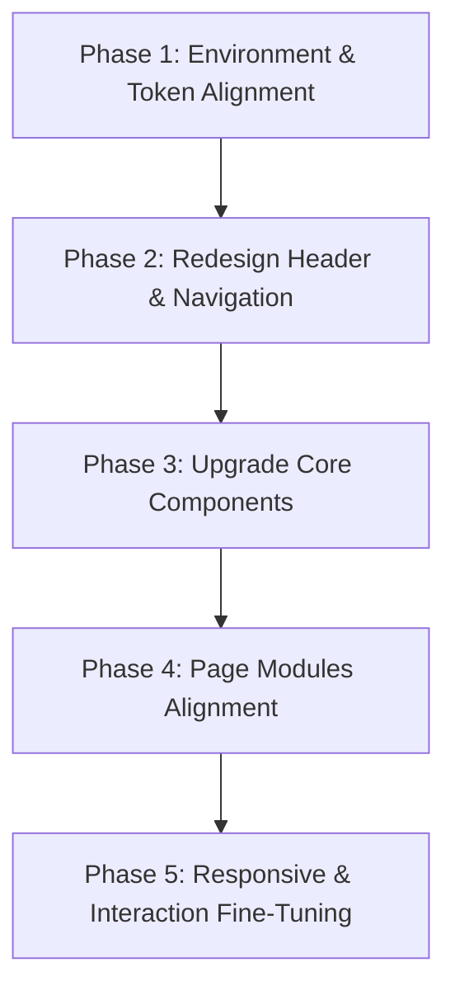

# System Update Specification: frontend_admin UI/UX Redesign & Alignment

This document outlines the system-level design requirements, user experience (UX) principles, and architectural steps required to upgrade the `frontend_admin` interface of the NATEAT platform. The primary goal is to establish complete visual alignment, layout consistency, and interactive smoothness with the existing `frontend_user` application, while shifting from a sidebar-based navigation layout to a top header-based system.

---

## 1. Overview

### 1.1 Goal
To modernize the NATEAT `frontend_admin` interface, transforming it into a natural, premium extension of the `frontend_user` application. This is achieved by unifying styling tokens, upgrading core components, smoothing out transitions, and refactoring navigation layouts.

### 1.2 Target Outcomes
- **100% Visual Consistency**: Identical color usage, border radii, shadows, typography, and spacing scales.
- **Top-Navigation Migration**: Shifting from a collapsible vertical sidebar layout to a sticky top navigation header, resolving layout compression and viewport clipping bugs.
- **Premium Micro-interactions**: Replacing abrupt visual jumps with smooth transitions, hover scales, and loading skeleton states.
- **Consistent State Feedback**: Standardizing inline validation, toast feedback, empty placeholders, and disabled form operations.

---

## 2. frontend_user Analysis

A comprehensive extraction of the visual identity and structural layout of the `frontend_user` application yields the following design specifications:

### 2.1 Layout & Grid Structure
- **Global Page Backdrop**: The user application uses a solid, deep brand purple background (`bg-[#66429c]`) for the primary screen wrappers (`min-h-screen`, `-mx-4`, `-my-7`).
- **Header Bar**: A sticky header (`sticky top-0 z-40`) with a height of exactly `68px` (`h-[68px]`). It is styled with a light background (`bg-[#fbfbfe]`), a bottom shadow (`shadow-sm`), and lateral padding (`px-6`).
- **Content Boundary**: Main contents are wrapped inside a centered layout grid limited to a maximum width of `1440px` (or `1324px` on dashboard contents) with automatic margins (`mx-auto`) and standard margins (`px-4 py-7 sm:px-6`).

### 2.2 Design Tokens
#### Colors (OKLCH Format)
All colors must adhere to the OKLCH design system:
- **`--primary`**: `oklch(0.52 0.22 290)` (Brand purple)
- **`--primary-deep`**: `oklch(0.42 0.20 290)`
- **`--primary-glow`**: `oklch(0.68 0.20 295)`
- **`--background`**: `oklch(0.97 0.005 280)` (Light violet-gray)
- **`--foreground`**: `oklch(0.18 0.04 280)` (Dark slate text)
- **`--card`**: `oklch(1 0 0)` (White)
- **`--border`**: `oklch(0.90 0.01 280)` (Light gray-purple divider)
- **`--input`**: `oklch(0.92 0.01 280)`
- **`--muted-foreground`**: `oklch(0.50 0.03 280)`
- **`--destructive`**: `oklch(0.62 0.22 25)`
- **`--warning`**: `oklch(0.72 0.18 50)`
- **`--success`**: `oklch(0.64 0.17 145)`
- **Brand Warning Yellow**: `#ffb11f` / `#ffbd2c` (Used for primary action highlights, floating CTAs, and warning highlights)
- **Primary Purple Accent**: `#7655aa` / `#65439a` (Used for primary button backgrounds, text links, and active nav states)

#### Typography
- **Font Stack**: `"Inter", Arial, "Times New Roman", sans-serif`
- **Font Weights**:
  - `font-extrabold` (800): Main screen titles, hero metrics.
  - `font-bold` (700): Buttons, section headers, active labels.
  - `font-semibold` (600): Navigation text links, table headers.
  - `font-medium` (500): Default body text.

#### Spacing Scales
Standardized spacing increments:
- Outer margins and gap grids: `gap-6` (24px) or `space-y-6` (24px).
- Internal element padding: `p-6` (24px) or `p-7` (28px) for cards, `px-4 py-3` for inputs, `px-3 py-1.5` for list nodes.

#### Border Radius Scale
Base token value: `--radius: 1rem` (16px)
- `rounded-[28px]`: Top-level interactive blocks (e.g., hero recommendations).
- `rounded-[20px]`: Standard dashboard cards and primary content panels.
- `rounded-[12px]`: List items, inner activity items, and nav items.
- `rounded-[8px]`: Action buttons, modal buttons, and input borders.

#### Shadows
- `shadow-card`: `0 4px 24px -8px oklch(0.52 0.22 290 / 0.15)`
- `shadow-elevated`: `0 10px 40px -12px oklch(0.52 0.22 290 / 0.25)`

### 2.3 Animation & Interactions
- **Micro-scaling**: Standard buttons and click targets scale slightly (`hover:scale-105` or `hover:scale-102` with `active:scale-95`).
- **Timing Functions**: Transition states utilize `duration-200` or `duration-300` using `ease-in-out`.
- **Skeleton Layouts**: Standardized loading containers that replicate the actual visual skeleton of the element instead of loading spinners.

### 2.4 UX Principles
- **Modularity**: Data is chunked into prominent white cards featuring broad rounded corners (`rounded-[20px]`) and soft shadows, resting over the deep purple global backdrop.
- **Action Highlight**: Core interactive nodes are color-coded with the warning yellow `#ffb11f` to distinguish primary workflows.

---

## 3. frontend_admin Issues

The current admin system suffers from several visual, structural, and interaction discrepancies compared to the user client:

### 3.1 Layout & Visual Inconsistencies
- **Backdrop Mismatch**: The admin viewport uses a standard light gray background (`bg-background` / `oklch(0.97 0.005 280)`) directly behind dashboard cards. This lacks the premium feel of the user app’s deep purple (`bg-[#66429c]`) layout backdrop.
- **Scroll Rigidness**: The admin workspace uses `h-screen overflow-hidden` on the layout wrapper and restricts scrolling strictly to the `<main>` tag. This causes a rigid browser scrolling experience and clips tooltips or dropdowns.

### 3.2 Navigation & Sidebar Collapse Friction
- **Sidebar Layout Shift**: The collapsing sidebar changes the content area width, forcing charts and tables to resize abruptly.
- **Clipping and Click Bugs**: Tooltips inside the collapsed sidebar get clipped when `overflow-hidden` is applied, and the sidebar collapse toggle button creates click dead zones around nearby layout elements.
- **Active State Differences**: Navigation items inside the sidebar use generic purple highlight blocks that do not match the bottom-border underline pattern and shadow overlays seen in `frontend_user`.

### 3.3 Interactive Jumps & Missing States
- **Sudden Loading Transitions**: The `PageLoader` displays a raw spinner while loading chunks, causing screen flash instead of utilizing layout placeholder skeletons.
- **Static Form Actions**: Input boxes lack transition animations on focus, and buttons do not show active loading spinner states during database write actions.

---

## 4. Navigation Redesign

The admin system is transitioning from a vertical sidebar to a clean top navigation header, mirroring the styling of `frontend_user`.

### 4.1 Structure & Layout
- **Header Dimensions**: Placed as a fixed top bar (`sticky top-0 z-40 flex h-[68px] w-full items-center justify-between bg-[#fbfbfe] px-6 shadow-sm border-b border-border/50`).
- **Brand Logo & Text**:
  - Located on the left: A warning yellow box (`grid h-10 w-10 shrink-0 place-items-center rounded-xl bg-[#ffb11f] text-white`) containing the brand symbol.
  - Alongside: "NATEAT Admin" (`ml-3 text-lg font-extrabold tracking-wide text-[#5b368d]`).
- **Central Navigation Links** (Visible on screens `xl` and wider):
  - Items list:
    1. **Dashboard** (`/dashboard`)
    2. **Quản lý người dùng** (`/users`)
    3. **Quản lý thực phẩm** (`/foods`)
    4. **Quản lý công thức** (`/recipes`)
    5. **Quản lý bữa ăn** (`/meals`)
    6. **Thống kê** (`/statistics`)
    7. **Cài đặt** (`/settings`)
  - **Active State Class**: `bg-[#eee9f7] text-[#65439a] shadow-[inset_0_-3px_0_#ffb11f]` (Ensures visual weight is anchored at the bottom edge).
  - **Inactive State Class**: `text-[#9790a6] hover:bg-[#f1edf7] hover:text-[#65439a]`.
  - **Transitions**: Smooth color swaps using `transition duration-200 ease-in-out`.

```
+---------------------------------------------------------------------------------------------------------+
| [PlusIcon] NATEAT Admin    Dashboard  Users  Foods  Recipes  Meals  Stats  Settings   (Avatar) (Logout)  |
+---------------------------------------------------------------------------------------------------------+
```

### 4.2 Dropdown & Profile Actions
- **Right-side Action Group**:
  - Language Selection Switcher: Toggles between "vi" and "en", styled with a small globe icon.
  - Profile Display: An orange avatar wrapper (`bg-[#ffbd2c] text-[#4b3178] border border-[#ffbd2c]/30 shadow-sm rounded-full h-9 w-9`) displaying the admin's initials.
  - Logout Button: A compact icon button (`grid h-10 w-10 place-items-center rounded-xl text-[#91889f] transition hover:bg-[#f1eef8] hover:text-destructive`) that triggers the confirmation modal.

### 4.3 Responsive Menu Adaptability
- **Header Collapse (Under `xl` Breakpoint)**:
  - The central horizontal menu is hidden on smaller screens (`hidden xl:flex`).
  - A mobile hamburger button (`xl:hidden`) appears on the left of the user avatar.
- **Drawer Menu Panel**:
  - Clicking the hamburger button slides in a full-height drawer panel from the top or right (`fixed top-[68px] right-0 bottom-0 w-[280px] bg-[#fbfbfe] shadow-lg border-l border-border z-50`).
  - The items inside the drawer display vertically, featuring prominent touch targets (`h-12 py-3 px-6 text-sm font-semibold rounded-xl transition hover:bg-[#f1edf7]`).
  - To prevent z-index issues, this drawer uses a clean backdrop overlay (`fixed inset-0 top-[68px] bg-black/40 z-40`).

---

## 5. UI System Alignment

Every core component in `frontend_admin` must align with the corresponding pattern in `frontend_user`.

### 5.1 Global Grid & Spacing
- **Backdrop Color Override**: Modify the layout grid wrapper to use the brand purple (`bg-[#66429c]`) instead of standard white or gray backgrounds.
- **Main Viewport Wrapper**: Remove layout restrictions and use a standard margins wrapper:
  ```html
  <main class="mx-auto max-w-[1440px] px-4 py-7 sm:px-6">
  ```

### 5.2 Component Audit

| Component | Current Issue | Target Styling & Structure |
| :--- | :--- | :--- |
| **Buttons** | Square shapes (`rounded-md`), solid primary colors without scaling animations, and no loader feedback during click actions. | Standardize to `rounded-[8px]` corners. Use `#7655aa` for primary actions and `#ffad1f` for warning actions. Implement hover micro-scaling (`hover:scale-102 hover:shadow-sm active:scale-98`) and show loading feedback inside buttons during actions. |
| **Tables** | Hard flat borders, standard rows without transition animations, and dark dividers. | Wrap tables inside a card component (`rounded-xl border border-border bg-card shadow-card overflow-hidden`). Set row hover states to a light purple (`hover:bg-[#faf8fd]`) with a 150ms transition. Add loading skeleton rows to prevent layout shifts. |
| **Forms** | Inconsistent input borders, boxy selectors, and default focus rings. | Use a unified input style (`rounded-[8px] border border-input focus-visible:ring-1 focus-visible:ring-[#7655aa] focus-visible:border-[#7655aa]`). Keep labels bold and uppercase (`text-xs font-bold text-muted-foreground uppercase tracking-wider`). |
| **Modals** | Default Dialog structures lacking semantic colors and action icons. | Wrap dialogs in the `AppModal` component. Style confirmations with specific accent colors: Success uses `#31c875`, Warning uses `#ff8a00`, and Destructive uses `oklch(0.62 0.22 25)`. |
| **Cards** | Flat borders with basic corners (`rounded-xl`). | Style cards with prominent rounded corners (`rounded-[20px]`) and a soft shadow (`shadow-card`). Use clean borders (`border-b border-border/40 pb-4`) to separate card headers from content. |
| **Badges** | Solid backgrounds that compete with the text color. | Replace with low-opacity pill shapes (`px-2.5 py-0.5 rounded-full text-xs font-semibold`). Active states use `bg-teal-500/10 text-teal-600 border border-teal-500/20`, Locked states use `bg-rose-500/10 text-rose-600 border border-rose-500/20`, and Admin badges use `bg-purple-500/10 text-purple-600 border border-purple-500/20`. |

---

## 6. Interaction & Smoothness

Smooth interactions are essential for a professional user experience.

### 6.1 Transition Speed Scale
All interactive style changes (hovers, selections, toggles) must follow a standard transition duration scale:
- **Fast (`150ms`)**: Tooltips, hover scales, focus outlines, checkbox checks.
- **Medium (`200ms`)**: Button hover states, text/link color shifts, active nav highlight indicators.
- **Slow (`300ms`)**: Slide-down menu drawers, modal overlay appearances, page layout adjustments.

### 6.2 Micro-Interactions
- **Interactive Scaling**: Standardize micro-scaling on all clickable layout nodes. Apply `hover:scale-102` and `active:scale-98` to cards and table action links.
- **Action Buttons**: Highlight hover actions with subtle translations (`hover:-translate-y-0.5`) and slight shadow lifts.

### 6.3 Loading & Performance Smoothness
- **Skeleton Placeholders**: Replace full-screen loading spinners with skeleton blocks matching the expected cards, tables, or charts layout.
- **Disabled Actions**: Disable action buttons during active requests and show a spinner icon (`Loader2 className="animate-spin"`) to prevent duplicate submits.

---

## 7. State Handling

Standardizing visual feedback patterns across pages prevents unexpected layout shifts or confusing flows.

### 7.1 Loading States
- **Form Submits**: When a form is submitted, disable all action buttons and inputs, and display a loader icon (`Loader2 className="h-4 w-4 animate-spin text-white"`).
- **Data Fetching**: Use skeleton blocks inside cards during initial loading to maintain layout structure.

### 7.2 Error States
- **Inline Errors**: Display Zod validation errors immediately below the input fields (`text-xs font-bold text-destructive mt-1.5`).
- **Input Borders**: Highlight invalid input fields with red borders (`border-destructive focus-visible:ring-destructive`).
- **Toast Alerts**: Show unexpected database mutation failures using `toast.error(message)` with richColors.

### 7.3 Empty States
- **Component Layout**: Standardize empty state displays across lists and tables using a clean placeholder panel.
- **Visual Design**: Center an `Inbox` or module-specific icon (`h-12 w-12 text-muted-foreground/30 mb-2`), followed by a bold header (`text-sm font-bold`), a clear description, and a primary action button to resolve the state.

### 7.4 Success Feedback
- **Toast Notifications**: Confirm successful operations (creates, updates, resets, exports) using `toast.success` alerts.
- **Interactive Updates**: Apply a 150ms fade-in animation to newly added items to highlight them in table lists.

---

## 8. Responsive Design

### 8.1 Desktop-First vs. Mobile Handling
- **Viewport Layout**: Use a mobile-friendly layout grid (`grid grid-cols-1 sm:grid-cols-2 lg:grid-cols-3 xl:grid-cols-6 gap-4`) to ensure dashboard KPI cards adapt cleanly to different viewports.
- **Breakpoint Rules**: Under `xl` (1280px), navigation links collapse into the hamburger drawer menu to protect header spacing.

### 8.2 Responsive Tables
- **Horizontal Scrolling**: Wrap tables in an overflow container (`overflow-x-auto`) to prevent layout breaking.
- **Column Priority**: Hide non-essential columns (e.g., Created Date, Phone Number) on mobile viewports (`hidden md:table-cell`).
- **Mobile Card View fallback**: Below `sm` (640px), transition dense tables into simple list cards, using high-radius borders and vertical listings.

---

## 9. Design Principles

### 9.1 Consistency Rules
- **Design Tokens**: Do not define custom hex codes in local inline CSS. Use Tailwind custom colors (e.g., `text-primary`, `bg-destructive`) mapped to the OKLCH tokens.
- **Border Radii**: Align all borders with the `--radius` configuration: card components use `rounded-[20px]`, buttons use `rounded-[8px]`, and inputs use `rounded-[8px]`.

### 9.2 Spacing & Margins
- **Spacing Grid**: Follow the standard 4px / 8px spacing increments. All margins, padding values, and element spacing must map directly to these scales (e.g., `gap-4` for 16px, `p-6` for 24px).

### 9.3 Component Reuse Rules
- Do not create custom wrappers or independent implementations for tables, inputs, or headers. Reuse standard shared components (`DataTable`, `AppModal`, `ConfirmDialog`, `PageHeader`).

### 9.4 Quick Guidelines (DOs and DON'Ts)

#### DOs
- **DO**: Use Tailwind `transition` variables on interactive elements (hover, focus, active).
- **DO**: Align page widths inside the standard container (`max-w-[1440px] mx-auto px-4 py-7`).
- **DO**: Disable action buttons during database mutation requests.
- **DO**: Style table headers using bold, uppercase text (`text-xs font-bold text-muted-foreground uppercase tracking-wider`).

#### DON'Ts
- **DON'T**: Implement a custom layout sidebar inside the admin viewport.
- **DON'T**: Use absolute values (e.g., px) for spacing properties. Use Tailwind scale tokens (e.g., `space-y-4`, `gap-6`).
- **DON'T**: Show page-level spinners during background content loads. Use skeleton placeholders.
- **DON'T**: Mix language keys. Ensure all strings pass through the `useT` hook.

---

## 10. Implementation Plan

Upgrading the admin interface follows a structured, step-by-step approach.



### 10.1 Upgrade Strategy
1. **Phase 1: Environment & Token Alignment**
   - Apply the deep purple backdrop (`bg-[#66429c]`) to the outer layout container.
   - Standardize body font properties, input styles, focus ring variables, and layout sizes.
2. **Phase 2: Redesign Header & Navigation**
   - Remove `AdminSidebar.tsx` and related styles from the app.
   - Refactor `AdminHeader.tsx` to include the branding logotype, central navigation links (`Dashboard` through `Settings`), and active states.
   - Build the hamburger drawer panel and mobile overlay layout for screen widths below `xl`.
3. **Phase 3: Upgrade Core Components**
   - Update buttons (`rounded-[8px]`, hover scaling, loader indicators).
   - Refactor `DataTable` wrappers (add hover styles, shadows, border-radius, and loading skeletons).
   - Implement Zod-based inputs, uppercase labels, and focused helper rings inside forms.
   - Unify confirm dialog operations under the `AppModal` layout structure.
4. **Phase 4: Page Modules Alignment**
   - Align pages (`DashboardPage`, `UserListPage`, `FoodListPage`, `RecipeListPage`, `MealListPage`, `StatisticsPage`, `SettingsPage`) with the updated page layouts, spacing, and styling rules.
   - Standardize page titles and action alignments using the `PageHeader` component.
5. **Phase 5: Responsive & Interaction Fine-Tuning**
   - Verify layout responsiveness on mobile, tablet, and wide monitors.
   - Add micro-interactions (hover translations, micro-scaling) to buttons and cards.
   - Add disabled states and spinners to form buttons to handle slow database operations.

### 10.2 Refactoring Risk Mitigation
- **Z-Index Conflicts**: Verify layout layers to ensure modal backdrops (`z-50`), drawer menus (`z-40`), and sticky headers (`z-40`) stack correctly.
- **Navigation Overflow**: Limit navigation link counts in the top header. If links overflow on mid-size monitors, wrap overflow nodes inside a "More Options" dropdown.
- **Responsive Layout shifts**: Ensure tables wrapped inside `overflow-x-auto` have defined minimum widths on individual headers to prevent header alignment bugs during scrolling.
- **State Synchronization**: Verify that changes made to the localStorage database (`nateat.db.v2`) from both `frontend_user` and `frontend_admin` update immediately across pages.
